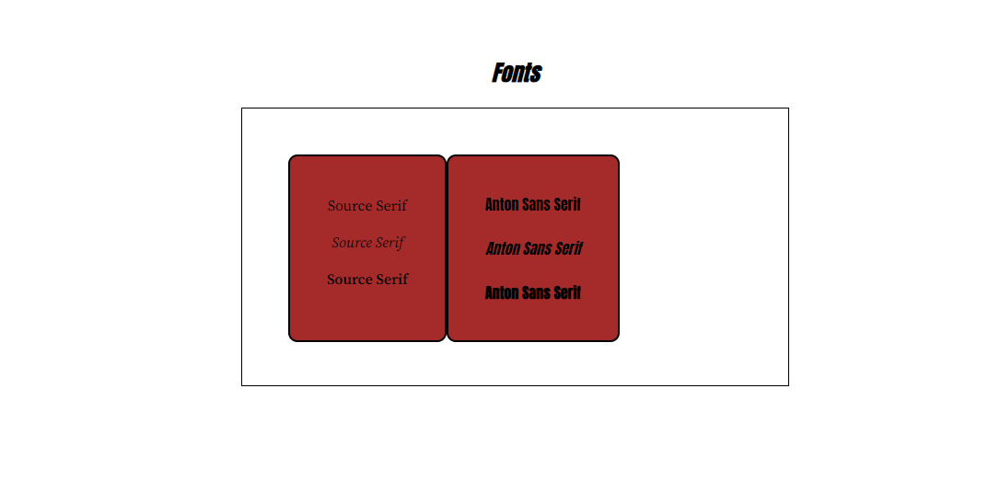

# Koolaid Request: Style Guide Font Section
Peer Review for Website Style Guide Project via Codecademy

## Current Font Section
<kbd></kbd>

## Request Modification
* Get bordered block elements to be same height and width
* Some spacing in between them

## Solution
Change to `solution-option` branch